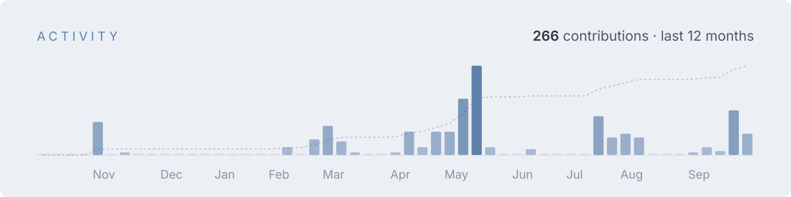
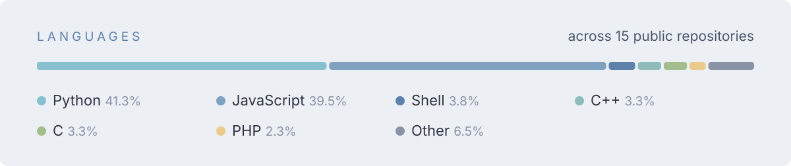
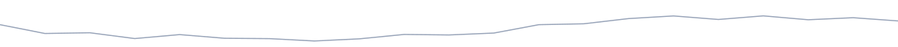

<!--
  chetak kumar · github profile readme
  nord palette, light + dark variants of every graphic (picked by <picture>).
  charts refresh daily via .github/workflows/profile-graphs.yml
-->

<picture>
  <source media="(prefers-color-scheme: dark)" srcset="./assets/header-dark.svg">
  
</picture>

I build systems that look at the real world and make sense of it: computer vision and machine learning models that run in production, agentic AI that acts on what they see, and the web apps around them. Lately that means visual quality inspection on the factory floor, video understanding, and assistive vision.

BCA · VIT Vellore

 

<table>
<tr>
<td width="64%" valign="top">

###  Selected work

**[Navigation for the Visually Impaired](https://github.com/Chetakk/Navigation-System-for-Visually-Impaired)** &nbsp;YOLO11 · DeepSORT · Flask
 Real-time detection, tracking and collision prediction turned into spoken guidance. Voice commands, gyroscope-corrected camera, no GPS or pre-mapped floor plans.

**[Temporal Operation Intelligence](https://github.com/Chetakk/VLMChallenge)** &nbsp;Vision-language model · Python · Docker
 Watches warehouse packaging video and answers three questions: what is the worker doing, when did it start and end, and what comes next.

**[AuraMind](https://github.com/Chetakk/AuraMind-Mental-Wellness-Assistant)** &nbsp;Kotlin · Python · Agentic AI
 Passive signals like sleep, steps and screen time feed an agentic loop that spots early signs of student burnout and loops in parents, without daily surveys.

**[Face Attendance](https://github.com/Chetakk/face-attendance-system)** &nbsp;React · TypeScript · Supabase
 Look at the camera, get marked present. Face recognition runs in the browser; row-level security guards the records.

**[Career Recommendation AI](https://github.com/Chetakk/Carrer-Recommandation-AI)** &nbsp;scikit-learn · Flask · React
 Hackathon build: a model trained on student performance and interests suggests career paths, served through a Flask API to a React front end.

**[Vrent](https://github.com/Chetakk/Vrent)** &nbsp;React · Redux Toolkit · Supabase
 A rental marketplace for everyday items, from laptops to cycles. Supabase auth, listings and a rental flow, built as a team project.

**[CipherSQLStudio](https://github.com/Chetakk/CipherSQLStudio)** &nbsp;PostgreSQL · LLM hints · in progress
 A browser SQL practice studio: pick an assignment, write queries in an editor, run them against real Postgres data, and ask an LLM for a hint rather than the answer.

**[e2e-playwright](https://github.com/Chetakk/e2e-playwright)** &nbsp;Playwright · CI
 252 end-to-end tests across 25 files, page-object model, three browser engines.

</td>
<td width="36%" valign="top">

###  Stack

M L &nbsp; &amp; &nbsp; C V 

A G E N T I C &nbsp; A I 

E D G E &nbsp; &amp; &nbsp; V I D E O 

I N D U S T R I A L 

B A C K E N D 

W E B &nbsp; &amp; &nbsp; M O B I L E 

D A T A &nbsp; &amp; &nbsp; I N F R A 

T E S T I N G 

</td>
</tr>
</table>

 

<picture>
  <source media="(prefers-color-scheme: dark)" srcset="./assets/activity-dark.svg">
  
</picture>

<picture>
  <source media="(prefers-color-scheme: dark)" srcset="./assets/languages-dark.svg">
  
</picture>

<picture>
  <source media="(prefers-color-scheme: dark)" srcset="./assets/footer-dark.svg">
  
</picture>
